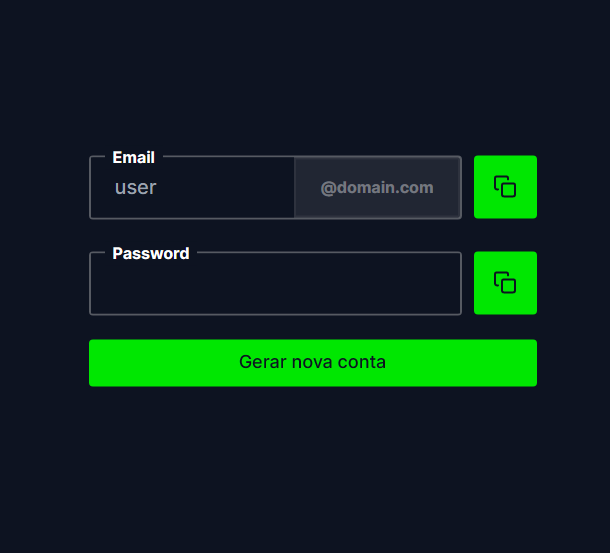

<p align="center">
  <a href="#"></a>
  <a href="#"></a>
  <a href="#"></a>
</p>

<p align="center">
  
</p>


## Demonstração

https://cuponsgenerate.vercel.app/

## Instalação

Clone o repositório com ```https://github.com/EduardoPH/CuponsGenerator```

Acesse a pasta do repositório e instale as dependências com ```npm i``` ou ```yarn install```

Para rodar o projeto, execute ```npm run dev``` ou ```yarn dev```

## Autores

- [Eduardo Mendes](https://www.github.com/EduardoPH)
